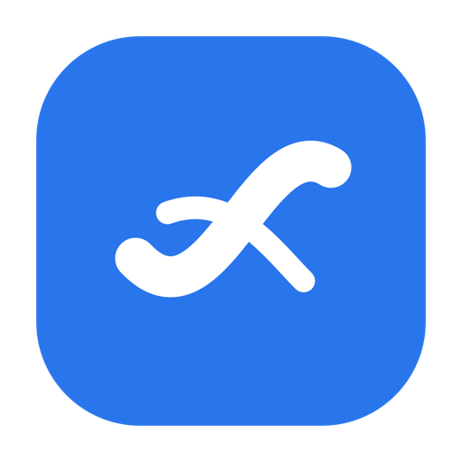

<p align="center">
  
</p>

<h1 align="center">Swoop</h1>

<p align="center">
  <strong>A lightweight, keyboard-first launcher for macOS.</strong><br>
  One shortcut. One box. Enter. Done.
</p>

<p align="center">
  
  
  
</p>

Swoop is a tiny native AppKit launcher. It stays out of the Dock, lives in the menu bar, and appears over fullscreen apps with **Option + Space**. It is not a Raycast clone: no plugins, no accounts, no cloud.

## Features

- Global hotkey (`Option + Space`)
- Borderless floating panel that can appear over fullscreen apps
- Two-stage actions: pick what to do, then type the argument
- Fuzzy ranking with aliases, pinyin, usage, and recency
- Unknown or weak queries fall back to Bing (Enter searches immediately)
- App launch from `/Applications`, `/System/Applications`, and `~/Applications`
- Web search, web shortcuts, and Baidu Translate
- Spotlight-backed file search (`mdfind` filename metadata)
- Lock Screen, Sleep, Screen Saver, Finder
- Installs as `/Applications/Swoop.app` (Launchpad / Spotlight)
- Launch at login when installed to Applications
- Menu bar extra: **Open Swoop** / **Quit Swoop**

## Requirements

- macOS 14 or later
- Xcode Command Line Tools (`xcode-select --install`)

## Install

```sh
git clone https://github.com/RoboHyperX/Swoop.git
cd Swoop
./install.sh
open /Applications/Swoop.app
```

`./install.sh` builds a local bundle and copies it to **`/Applications/Swoop.app`**, so it shows up in Launchpad, Spotlight, and Applications. Launch at Login is registered automatically from that installed copy.

The app is ad-hoc signed and is not notarized.

### Uninstall

```sh
./uninstall.sh              # quit, unregister login item, remove /Applications/Swoop.app
./uninstall.sh --purge-data # also delete preferences and usage history
```

If the app was already deleted by hand, remove any leftover login item in **System Settings → General → Login Items**.

## Build from source

```sh
./build.sh            # write .build.noindex/Swoop.app
./build.sh --install  # build and install to /Applications
./build.sh --check    # compile only
./run.sh              # local build + launch
./test.sh             # tests
```

Compilation intermediates live in `.build.noindex/`.

If the default Command Line Tools SDK is newer than the installed Swift compiler, the build scripts prefer a macOS 15 SDK when present.

## Usage

1. Open **Swoop** from Launchpad or `/Applications/Swoop.app` (once).
2. Press **Option + Space** from anywhere.
3. Type 2–4 characters until the action you want is first.
4. **Enter** confirms. Search and file actions enter a second stage.
5. **Esc** goes back, then closes.

```text
chr → Enter                    open Google Chrome
chat → Enter                   open ChatGPT
goo → Enter → robot policy     Google Search
bin → Enter → query            Bing Search mode
键盘 → Enter                   Bing search for 键盘
zh2en → Enter → 键盘           Baidu Translate ZH→EN
github → Enter                 open GitHub
ghs → Enter → ManiSkill        GitHub Search
sch → Enter → diffusion        Google Scholar
fin → Enter → root.tex         list files, Enter opens
loc → Enter                    lock screen
```

## Keyboard shortcuts

| Key | Action |
| --- | --- |
| Option + Space | Open or hide the launcher |
| ↑ / ↓ | Move the selected candidate |
| Enter | Confirm action or execute |
| Esc | Back to action list, then close |
| ⌘K | Clear the current query |
| Click outside | Close |

## Actions

**Web shortcuts** (Enter opens the site): ChatGPT, Grok, Gemini, Bilibili, Douyin, GitHub.

**Web search** (two-stage): Google, Bing, GitHub Search, YouTube, Google Scholar, arXiv, Xiaohongshu.

**Translation** (two-stage, Baidu): ZH → EN (`zh2en`, `中译英`), EN → ZH (`en2zh`, `英译中`).

**System:** Lock Screen (`loc`), Sleep, Screen Saver, Finder.

**Files:** Find Files (`fin`).

Applications discovered at launch become first-class actions (`chr` → Google Chrome, `vsc` → Visual Studio Code).

## Project layout

```text
Sources/     AppKit launcher, actions, search, services
Tests/       swiftc test runner
Scripts/     App icon / logo generator
build.sh     compile
install.sh   install to /Applications
uninstall.sh remove the installed app
run.sh       local build + launch
test.sh      tests
```

No third-party packages. Linked frameworks: AppKit, Carbon, ApplicationServices, ServiceManagement.

## License

MIT. See [LICENSE](LICENSE).
